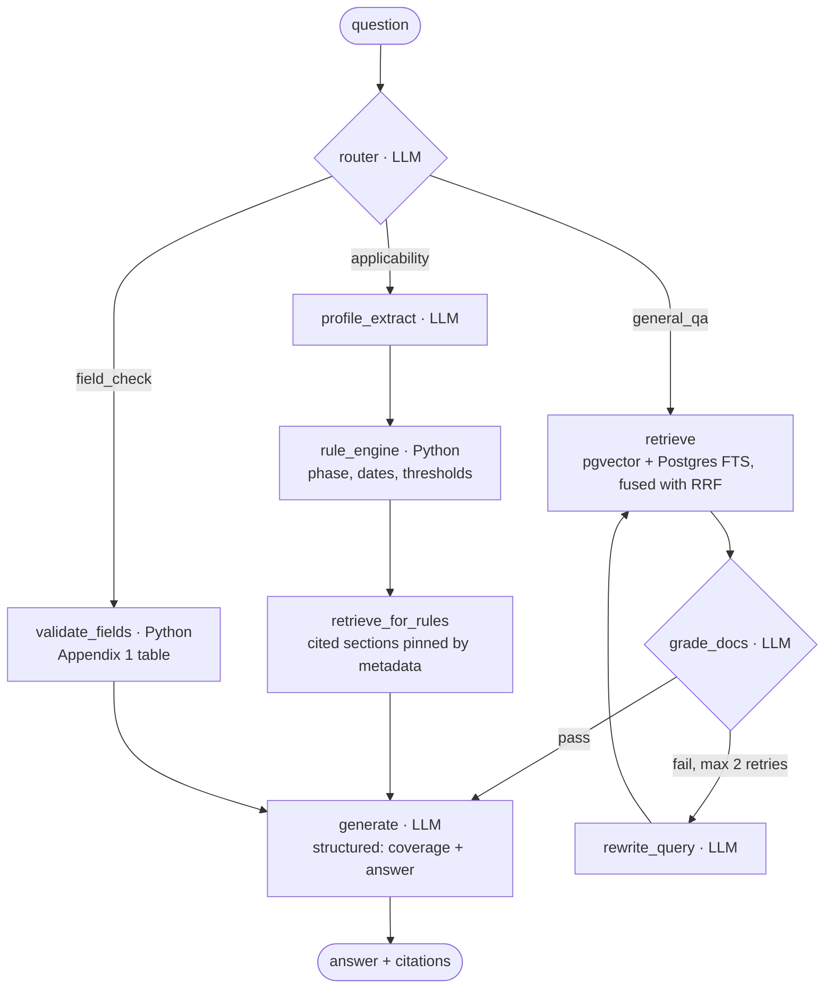

# MyInvois Compliance Copilot

An agentic RAG assistant for Malaysia's mandatory e-Invoicing (LHDN / MyInvois), grounded
in the official IRBM guidelines. Every answer cites the guideline **version and section
number**, and every citation opens the source text it points at. Compliance outcomes —
which implementation phase a business falls into, from what date, under which relaxation —
are decided by a **deterministic rule engine, never by the LLM**.

See [PLAN.md](PLAN.md) for the full architecture and two-week build plan.

## Status

**Day 11 of 14 — live.** <https://myinvois-api.ambitiousbush-8ab23d9e.southeastasia.azurecontainerapps.io>

| | |
|---|---|
| Corpus | 420 chunks — 86 Guideline v4.8, 194 Specific Guideline v4.8, 140 FAQ 2026-05-05 |
| Graph | 3 intents (general QA / applicability / field check) with a corrective-RAG retry loop |
| Rule engine | Deterministic Python; decides every date, threshold and phase |
| Golden set | 21/21 on Azure (`uv run python scripts/eval.py`) |
| RAGAS | Faithfulness 0.950, answer relevancy 0.803 (n=17 of 21). Retrieval scores fell over the same change — see [Evaluation](#evaluation-ragas) |
| Cost | ≈5,400 tokens per answer (112,923 over the 21-case run); P50 5.7s warm, ~34s cold start at min-replicas 0 |
| Serving | Azure Container Apps + Azure PostgreSQL 16 (pgvector 0.8.2), 565MB image, scale-to-zero |
| Models | Azure OpenAI primary, Groq fallback; bge-small embeddings baked into the image |
| CI | GitHub Actions: 120 tests + ruff → ACR build → deploy. The test job needs no secrets |

Remaining: Day 12 documentation, 13 user testing, 14 buffer.

## Architecture



The LLM classifies, extracts, grades, rewrites and explains. **It never decides a
compliance outcome.**

### Why the rule engine is not an LLM

Whether a business must issue an e-Invoice, from what date, under which relaxation, is a
lookup in a published table — not a judgement. A model reading that table is a worse
oracle than the table.

The failure is measured, not hypothetical. Asked *how long is the relaxation period for
Phase 4?*, the model answered "six (6) months" from §16.1's prose while the rule engine's
Table 16.1 fact sat in the same prompt. Fluent, correctly cited, and wrong. So
`rule_engine` computes phase, implementation date, relaxation window and thresholds from
`params.json` in pure Python and hands `generate` a fixed block; the model's only job is
to say it in English with the citations the engine already chose.

It is the cheapest part of the system to be certain about, and the part where a wrong
answer would cost the user most — so it is the part with unit tests that double as
documentation of the rules.

## How to run locally

Requires [uv](https://docs.astral.sh/uv/) and Docker Desktop. In PowerShell:

```powershell
# 1. Dependencies (uv fetches Python 3.11 itself; nothing global changes)
uv sync

# 2. Postgres 16 + pgvector
docker compose up -d

# 3. Config
Copy-Item .env.example .env

# 4. Source PDFs -> data/raw/   (docs/ingestion.md has the script; the slug is
#    case-sensitive and the lowercase one serves a stale v4.6)

# 5. Ingest (first run downloads the ~130MB embedding model)
uv run python scripts/ingest.py

# Checks
uv run pytest -q
uv run ruff check .
```

`--dry-run` parses and reports without touching the database.

## Ingestion

`scripts/ingest.py` turns the LHDN PDFs into citable chunks: split per section, with a
per-document heading regex declared in `data/raw/manifest.json`, and a check that each
heading *continues* the document's numbering — without which a date (`1.7.2021`) and a
glossary reference both become phantom sections. A section that is really a table is split
one chunk per row. Re-ingesting a version replaces it, keyed on `(doc, version)`. Hybrid
search is Postgres-only: an HNSW index on `vector(384)` beside a generated `tsvector` with
a GIN index, fused with RRF.

The design decisions and the real defect behind each: [docs/ingestion.md](docs/ingestion.md).

### Current corpus

| Document | Version | Sections | Chunks |
|---|---|---|---|
| e-Invoice Guideline (General) | 4.8 (30 Aug 2026) | 51 | 86 |
| e-Invoice Specific Guideline | 4.8 (7 Jul 2026) | 17 | 194 |
| e-Invoice General FAQs | updated 5 May 2026 | 127 | 140 |

420 chunks, up from 343 before Day 11 split tables into rows. The section counts are
unchanged: a row chunk keeps its section's label, which is what keeps citations stable.

> The PDF URL slug is **case-sensitive**, and the lowercase one serves a stale v4.6. See
> [fetching the source PDFs](docs/ingestion.md#fetching-the-source-pdfs).

## Verifying an answer

The project's claim is that an answer can be checked. Until Day 11 that meant opening a
200-page PDF and finding §1.6.1(e) by hand — which nobody does, so in practice the
citations were decoration.

Every citation is now a button. Clicking one expands the stored source chunk in place,
with its document, version, section and page. `GET /chunk?ref=<citation>` re-reads a row
the ingest already wrote: read-only, no LLM call, and it keeps working after the daily
quota is spent — which is exactly when someone is left holding an answer they want to
check. The panel shows the section and page of the row that was **actually stored**, not
the ones the answer wrote, so a mismatch is visible rather than hidden.

There is one "Report a problem" link under each answer, and **no rating widget**. A user
asking whether they must issue an e-Invoice cannot judge whether the answer is correct —
that is *why* they are asking — so a rating would measure how plausible an answer *feels*,
which is the failure mode this whole design removes. The click carries no free text and no
user identifier; the server already holds the rest, and `scripts/feedback.py` turns a
report into a LangSmith execution tree, and from there a golden case.

## Evaluation (RAGAS)

| Metric | Day 10 baseline | After Day 11 | Cases |
|---|---|---|---|
| Faithfulness | 0.922 | **0.950** | n=17 |
| Answer Relevancy | 0.806 | 0.803 | n=17 |
| Context Precision (rag only) | 0.750 | 0.750 | n=2 |
| Context Recall (rag only) | 1.000 | 1.000 | n=2 |
| Context Precision (rule-engine cases) | 0.882 | **0.700** | n=13 |
| Context Recall (rule-engine cases) | 0.551 | **0.436** | n=13 |

Same judge, same scored cases, both runs. Faithfulness rose; retrieval fell over the very
change that took the golden set to 21/21. **That disagreement is the most interesting
result in the project, and it is not resolved.** The two candidate mechanisms, the untested
rank-position hypothesis and the one experiment that would settle it — plus the pending
cross-judge run and what a run costs — are in [docs/evaluation.md](docs/evaluation.md).

## Cost and abuse

| Guard | Mechanism | When it trips |
|---|---|---|
| Input size | 2,000 characters | 413 naming the limit, before the graph runs |
| Request rate | per IP: `/chat` 10/min, `/feedback` 20/min, `/validate` 30/min, `/chunk` 60/min | 429 |
| Daily spend | 150,000 tokens, counted in Postgres and charged at the client in `get_llm()` | 429 with the UTC reset time |
| Idle cost | Container Apps min-replicas 0 | scales to zero; ~34s cold start |
| Cost drift | $20/month budget alerts, actual and forecast | email before the bill, not after |

Two properties matter more than the numbers.

**Degrading is not the same as answering worse.** When the budget is spent, classification
still runs on the small model but *answering does not fall back*: `chosen_model()` raises
rather than serve a compliance answer from a weaker model, because that is exactly how the
"six (6) months" error above was produced. `/validate`, `/chunk` and `/health` touch no
LLM, so invoice validation and citation checking keep working with the quota gone.

**Nothing leaks on the way out.** Secrets reach Azure as Container Apps secrets — never a
file, an image layer or a command line — and the unhandled-exception handler returns a
message and an exception type, never a traceback, to a public URL.

## Known limitations

- **The golden set and RAGAS disagree about Day 11, and the disagreement is unresolved.**
  The same change that took the golden set to 21/21 moved retrieval scores down; which
  instrument is right is a named experiment nobody has run. See
  [Evaluation](#evaluation-ragas).
- **One token counter serves development and production.** On 2026-09-04 a day of
  evaluation work spent 1,032,879 tokens against a raised *local* ceiling. Production's own
  limit stayed at its 150,000 default — the deploy script unsets the override — but the
  counter is global, so the live app reported `remaining: 0` and refused new questions for
  the rest of the day. Nobody had asked it anything; the outage was real, just unwitnessed.
  A per-environment or per-key ceiling is the obvious shape. It is not built.
- Development ran at a 1,200,000-token ceiling for a single day of evaluation against
  production's 150,000. They buy different things: one caps a day of public traffic, the
  other buys a scoring run — one RAGAS pass alone is ~263,000 tokens.
- Tables that extract as text are chunked one row per chunk since Day 11. A heading whose
  content is a *figure* still yields nothing to chunk; those are flagged `THIN SECTIONS`
  on every ingest run.
- `§Appendix 1` citations are served from `data/rules/invoice_fields.json`, the same table
  the field checker reads — Appendix 1 was never ingested as chunks. The citation opens,
  but the appendix is not retrievable: no answer can reach it through search.
- Source PDFs are gitignored (large, re-downloadable); `manifest.json` is tracked.

## Frontend

A mobile-first SPA — Vite, React, TypeScript, no UI or state-management libraries. **Ask**
is multi-turn chat with clickable citations; **Check Invoice** validates against Appendix 1
deterministically and spends no tokens, so it keeps working when the budget is gone.
Features, build and image-size detail: [docs/frontend.md](docs/frontend.md).

## Disclaimer

Informational only. Not tax or legal advice. Verify against the official LHDN documents.
